<!-- Imports -->

<!-- Documentation -->

These API endpoints allow anyone to interact with the Hermes Protocol platform in a decentralized way. Through these, developers can create notifications for their users using their own dApp, increasing UX without compromising on user's privacy.

## Base URL

```
https://api.hermesprotocol.io/api/public
```

### Endpoints

[**POST /verify-user**](verify-user) - See if a certain wallet address is registered on the platform.

[**POST /generate-bytes**](generate-bytes) - Request a [nonce](https://www.okta.com/identity-101/nonce/) to use in decentralized yet authenticated user requests. 

[**POST /notification**](notification) - Create a notification so that users are alerted 

### User Interaction flow

```mermaid
sequenceDiagram
    participant User
    participant Front-end
    participant Generate Bytes API
    participant Notification API
    User->>Front-end: Clicks 🔔 button
    Front-end-->>User: Shows pop-up to pick options
    User->>Front-end: Fills everything and <br/>clicks "Add Notification"
    Front-end->>Generate Bytes API: Requests a nonce for <br/>the user to sign
    Generate Bytes API-->>Front-end: Returns the nonce if the user <br/>exists on Hermes Protocol
    Front-end-->>User: Requests signing a message <br/>with the notification info + nonce
    User->>Front-end: Signs the message
    Front-end->>Notification API: Requests for the notification <br/>to be added to the user
    Notification API-->>Front-end: Returns one of multiple status codes, <br/>depending if the user has a linked social <br/>account already, among other things.
    Note right of Notification API: Possible HTTP <br/>status codes: <br/>200, 202, 400, 401
    Front-end-->>User: Users sees final confirmation
```




## Supported Notifications

These are the supported notifications that you can create using the **Hermes Protocol** Public API.

For an exhaustive list, please find all created IDs [here](ids).

### Notifications

#### Liquid Staking (Backbone Labs / Gravedigger)

| NotificationTypeId | ChainId | CategoryId | ProjectId |
| :----------------- | :------ | :--------- | :-------- |
| 002_0029           | zb1_002 | zb3_0008   | zb2_0034  |

**Notification Parameters**

**contract**

```
terra1l2nd99yze5fszmhl5svyh5fky9wm4nz4etlgnztfu4e8809gd52q04n3ea
```

**tokenContract**

```
terra17aj4ty4sz4yhgm08na8drc0v03v2jwr3waxcqrwhajj729zhl7zqnpc0ml
```

**stakes / queueUnbond / submitBatch / finishUnbond**

| Param | Type       | Description                                                                     |
| :---- | :--------- | :------------------------------------------------------------------------------ |
| flag  | boolean    | Whether the user wishes to receive alerts about this event or not               |
| value | number     | Value to compare with the event                                                 |
| type  | comparison | Type of comparison used between the value configured and the value on the event |

Example

```json
{
  "stakes": {
    "flag": true,
    "value": 10,
    "type": "="
  },
  "queueUnbond": {
    "flag": true,
    "value": 25,
    "type": "<"
  },
  "submitBatch": {
    "flag": true,
    "value": 12,
    "type": "<="
  },
  "finishUnbond": {
    "flag": true,
    "value": 100,
    "type": ">"
  }
}
```

**scope**

```
zc5_0001
```
