These API endpoints allow anyone to interact with the Hermes Protocol platform in a decentralized way. Through these, developers can create notifications for their users using their own dApp, increasing UX without compromising on user's privacy.

## Base URL

```
https://api.hermesprotocol.io/api/public
```

### Endpoints

[**POST /verify-user**](verify-user) - See if a certain wallet address is registered on the platform.

[**POST /generate-bytes**](generate-bytes) - Request a [nonce](https://www.okta.com/identity-101/nonce/) to use in decentralized yet authenticated user requests. 

[**POST /notification**](notification) - Create a notification so that users are alerted 

### User Interaction flow

```mermaid
sequenceDiagram
    participant User
    participant Front-end
    participant Generate Bytes API
    participant Notification API
    User->>Front-end: Clicks 🔔 button
    Front-end-->>User: Shows pop-up to pick options
    User->>Front-end: Fills everything and <br/>clicks "Add Notification"
    Front-end->>Generate Bytes API: Requests a nonce for <br/>the user to sign
    Generate Bytes API-->>Front-end: Returns the nonce if the user <br/>exists on Hermes Protocol
    Front-end-->>User: Requests signing a message <br/>with the notification info + nonce
    User->>Front-end: Signs the message
    Front-end->>Notification API: Requests for the notification <br/>to be added to the user
    Notification API-->>Front-end: Returns one of multiple status codes, <br/>depending if the user has a linked social <br/>account already, among other things.
    Front-end-->>User: Users sees final confirmation
```




## Supported Notifications

These are the supported notifications that you can create using the **Hermes Protocol** Public API:

- Price alert
- Validator Profile Changes
- Governance Poll
- NFT Monitor
- [Wallet Monitor](notification/wallet-monitor)
- New Sale
- Liquidity Pool
- [Liquid Staking](notification/liquid-staking) 
- Domain Changes


For an exhaustive list, please find all created IDs [here](ids).


